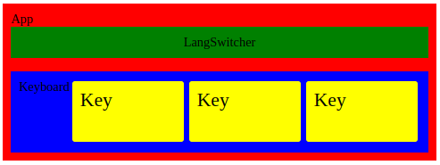
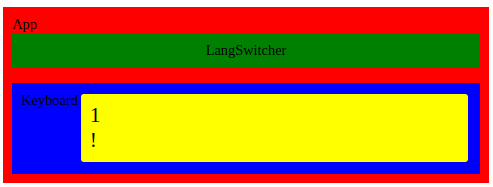
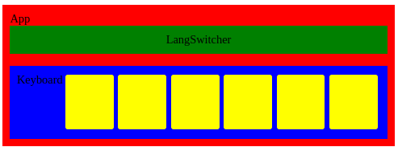
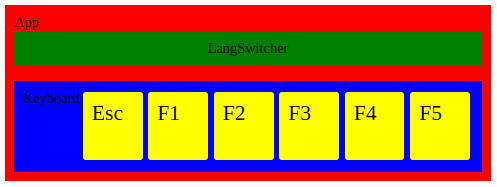
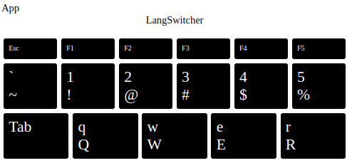
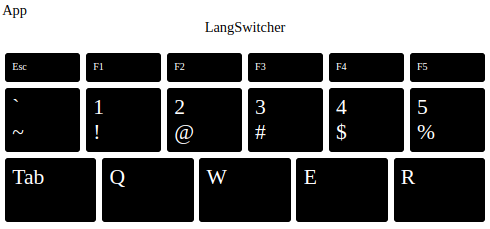
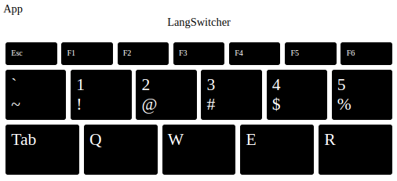
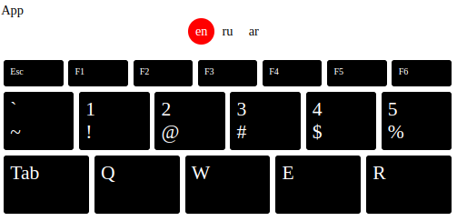
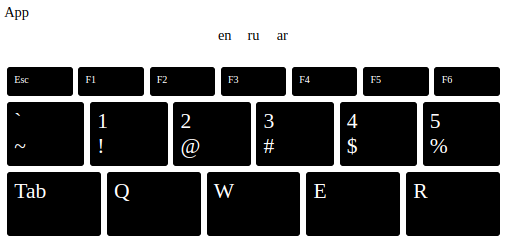

- [Modularity](#modularity)
	- [JavaScript](#javascript)
	- [Framework](#framework)
		- [Setup](#setup)
		- [Entry point — index.js](#entry-point--indexjs)
		- [Root component — App.js](#root-component--appjs)
	- [Components hierarchy](#components-hierarchy)
		- [App](#app)
		- [LangSwitcher](#langswitcher)
		- [Keyboard](#keyboard)
		- [Key](#key)
	- [Components (real)](#components-real)
		- [Key](#key-1)
			- [passing prop (v-bind)](#passing-prop-v-bind)
			- [computed (template variables)](#computed-template-variables)
		- [Rows](#rows)
			- [loop in template (v-for)](#loop-in-template-v-for)
			- [1st loop — rows of the keyboard](#1st-loop--rows-of-the-keyboard)
			- [2nd loop — keys of a row](#2nd-loop--keys-of-a-row)
		- [LangSwitcher — refactor with props and v-for](#langswitcher--refactor-with-props-and-v-for)
		- [App -- async state keyboardData](#app----async-state-keyboarddata)
	- [Conclusion](#conclusion)

## Modularity

What we have written until now are markup and styles.

I am sorry to say, but: HTML and CSS aren't programming languages.

Modularity can be achieved by programming.

### JavaScript

Browser apps are coded in JavaScript (JS).

JS was made in 1995 and DOM (document object model in the browser) — in 1998. Writing code in plain (vanilla) JS and direct manipulations with DOM is kinda hard (and old fashioned).

But there is no alternative to JS.

### Framework

So programmers invented modern frameworks, that make coding web apps easier, clearer and faster. We will use the simplest of them: Vue. Also frameworks allow us to write JS in a '[[yucomponent way.

#### Setup

In index.html comment all code inside tag `<body>`. We need it in the future, but not now.

index.html

```html
<body>
  <!--
    ...
    -->
</body>
```

Copy code example from: https://vuejs.org/guide/quick-start.html#without-build-tools (or from here):

```html
<script src="https://unpkg.com/vue@3"></script>

<div id="app">{{ message }}</div>

<script>
  const { createApp } = Vue

  createApp({
    data () {
      return {
        message: 'Hello Vue!'
      }
    }
  }).mount('#app')
</script>
```

and paste it to index.html after `<body>` tag. If on top of the page appeared “Hello Vue!” it means that setup works.

Even though it works, we need to orginize code better.

#### Entry point — index.js

Put first `<script>` tag into the `<head>` tag.

index.html

```html
<head>
  ...
  <script src="https://unpkg.com/vue@3"></script>
</head>
```

Copy second `<script>` tag content (and remove whole tag). Create in project root directory a file `index.js` and paste there what you've copied before.

index.js

```javascript
const { createApp } = Vue

createApp({
  data () {
    return {
      message: 'Hello Vue!'
    }
  }
}).mount('#app')
```

In index.html, just before closing `</body>` tag add string:

index.html

```html
    ...
    <script src="./index.js" type="module"></script>
</body>
```

Attribute `type="module"` allows us to use ES6 feature `import/export`. We need it on the next step.

index.html (result)

```html
<head>
  ...
  <script src="https://unpkg.com/vue@3"></script>
</head>
<body>
  <div id="app">{{ message }}</div>
  <!-- ... -->
  <script src="./index.js" type="module"></script>
</body>
```

index.js is called the entry point. It mounts all our app code into `index.html` document.

If you did everything right, you should see "Hello Vue!" at the top of the page as before.

#### Root component — App.js

Open index.js. The code inside createApp(...) is a vue component (root component) — cut it (ctrl+x or copy and delete). We will move it to separate file: App.js — create it in a project root directory. Paste there a code you copied before (ctrl+v) to `const App`. Then export it.

App.js

```javascript
const App = {
  data () {
    return {
      message: 'Hello Vue!!'
    }
  }
}

export default App
```

Then import it in `index.js` and put into createApp(...)

index.js

```javascript
import App from './App.js'

const { createApp } = Vue

createApp(App).mount('#app')
```

If you did everything right, you should see "Hello Vue!" at the top of the page as before.

### Components hierarchy

First we create all components as a colored rectangles to test how works our framework. That’s the hierarchy:

```html
<App>
  <LangSwitcher />
  <Keyboard>
    <Key />
  </Keyboard>
</App>
```

`<App>` is parent for `<LangSwitcher>` and `<Keyboard>`.

`<Keyboard>` is parent for `<Key>`.

`<App>` is grandpa for `<Key>` :smile:.

#### App

We already have `App` component. Just add to

styles.css

```CSS
...
#app {
	background-color: red;
	padding: 10px;
}
```

All styles in this section are temporary, we need them to see nesting of the components. Then we'll delete them.

Now App is a red rectangle.


#### LangSwitcher

Create a directory `components` in the project root directory, and create there a file `LangSwitcher.js`

```javascript
const LangSwitcher = {
  template: `<div class="langSwitcher">LangSwitcher</div>`
}

export default LangSwitcher
```

and add to

styles.css

```CSS
...

.langSwitcher {
	background-color: green;
	padding: 10px;
}
```

Add a newly created component to

App.js

```javascript
import LangSwitcher from './components/LangSwitcher.js'

const App = {
  template: `App <vue-lang-switcher />`,
  components: {
    'vue-lang-switcher': LangSwitcher
  }
}

export default App
```

Result:


We see here that App contains LangSwitcher wich is correct.

#### Keyboard

Create a file `Keyboard.js` in a `components` folder

Keyboard.js

```javascript
const Keyboard = {
  template: `<div class="keyboard">Keyboard</div>`
}

export default Keyboard
```

Add to

styles.css

```css
... .keyboard {
  background-color: blue;
  padding: 10px;
  display: flex; /*to display keys in a row, on next step*/
}
```

Add a new component Keyboard to

App.js

```javascript
import Keyboard from './components/Keyboard.js'
import LangSwitcher from './components/LangSwitcher.js'

const App = {
  template: `App 
	<vue-lang-switcher />
	<vue-keyboard />
	`,
  components: {
    'vue-lang-switcher': LangSwitcher,
    'vue-keyboard': Keyboard
  }
}

export default App
```

Now the app looks like:


#### Key

Create file `Key.js` in `components` directory

Key.js

```javascript
const Key = {
  template: `<div class="key">Key</div>`
}

export default Key
```

Add to

styles.css

```css
.key {
  background-color: yellow;
  padding: 10px;
  color: black;
}
```

As you remember `Key` is the child of `Keyboard` so it should be imported in `Keyboard`, not in `App.js`.

Keyboard.js

```javascript
import Key from './Key.js'

const Keyboard = {
  template: `<div class="keyboard">
                    Keyboard
                    <vue-key />
                    <vue-key />
                    <vue-key />
                </div>`,
  components: {
    'vue-key': Key
  }
}

export default Keyboard
```

After saving all files, that’s how our app looks:



Our component hierarchy works well. All components have correct nesting. How we said it the beginning of the chapter:

> `<App>` is parent for `<LangSwitcher>` and `<Keyboard>`.
> `<Keyboard>` is parent for `<Key>`.

### Components (real)

For now our components are a colored rectangles with some static content (text). In real components all content is dynamic, passed by `props`.

Props are external params (variables) that we pass from parent to child.

The idea of a component is that we recieve external data from parent (`props`), and put them into html-like template with empty slots for these props.

#### Key

##### passing prop (v-bind)

Open `index.html`, copy one of the key code, that we commented before, and paste it to template in

Key.js

```javascript
const Key = {
  template: `<div class="key">
                                <div class="main">1</div>
                                <div class="shifted">!</div>
                            </div>`
}

export default Key
```

We described our ["Data model"](#data-model) in a section above. Open `keyboardData/en.js` and find the data for a single key:

keyboardData/en.js

```javascript
{
	code: 'Digit1',
	main: '1',
	shifted: '!',
	mainName: 'one',
	shiftedName: 'exclamation mark'
}
```

copy it.

We will pass this object to `Key` component as a prop `keyContent`.

Keyboard.js

```javascript
import Key from './Key.js'

const keyData = {
  /*paste here copied data*/ code: 'Digit1',
  main: '1',
  shifted: '!',
  mainName: 'one',
  shiftedName: 'exclamation mark'
}

const Keyboard = {
  template: `<div class="keyboard">
                        Keyboard
                        <vue-key :keyContent="keyData" />
		    </div>`,
  components: {
    'vue-key': Key
  },
  data () {
    return { keyData }
  }
}

export default Keyboard
```

Here we:

- described data of Key in `const keyData`
- made the component see this data with `data(){}` method
- passed `keyData` as a prop to child `Key` component

Notice, when we pass prop, we use colon `:` before its name.

```javascript
<vue-key :keyContent="keyData" />
```

In that case framework interpet “keyData” as a variable name.

Otherwise (wihout `:`) it would be interpreted as a string.

`<vue-key keyContent="keyData" />` —> Key component will recieve string “keyData” instead of the object `keyData`.

Now we should warn `Key` about a new prop.

Key.js

```javascript=
const Key = {
  template: `<div class="key">
                        <div class="main">
                            {{ keyContent.main }}
                        </div>
                        <div class="shifted">
                            {{ keyContent.shifted }}
                        </div>
                    </div>`,
  props: {
    keyContent: Object
  }
}

export default Key
```

1. We told component about a prop `props: {keyContent: Object}`
2. We told template how to use props by `{{ }}`.

Result:



Return to `Keyboard.js`. We already have all key data in `keyboardData/en.js` so let’s import and use it, instead of a single key data:

Keyboard.js

```javascript
import Key from './Key.js'
import keyboardData from '../keyboardData/en.js'

const Keyboard = {
  template: `<div class="keyboard">
                        Keyboard
                        <vue-key :keyContent="keyboardData[1][0]" />
                        <vue-key :keyContent="keyboardData[1][1]" />
                        <vue-key :keyContent="keyboardData[1][2]" />
                        <vue-key :keyContent="keyboardData[1][3]" />
                        <vue-key :keyContent="keyboardData[1][4]" />
                        <vue-key :keyContent="keyboardData[1][5]" />
                    </div>`,
  components: {
    'vue-key': Key
  },
  data () {
    return { keyboardData }
  }
}

export default Keyboard
```

Now we have less code and more keys:


##### computed (template variables)

If we try to display first row `keyboardData[0]` (Esc, F1, F2, …)

```javascript
    ...
    template: `<div class="keyboard">
                        <vue-key :keyContent="keyboardData[0][0]" />
                        <vue-key :keyContent="keyboardData[0][1]" />
                        <vue-key :keyContent="keyboardData[0][2]" />
                        <vue-key :keyContent="keyboardData[0][3]" />
                        <vue-key :keyContent="keyboardData[0][4]" />
                        <vue-key :keyContent="keyboardData[0][5]" />
                </div>`,
    ...
```

we will get empty yellow rectangles:



That’s because these keys doesn’t have `main` or `shifted` values:

```javascript
;[
  { code: 'Escape', label: 'Esc' },
  { code: 'F1' },
  { code: 'F2' },
  { code: 'F3' },
  { code: 'F4' },
  { code: 'F5' }
]
```

So we need to compute them from other params: `code` and `label`. Vue component has especial property `computed` for such computations.

Key.js

```javascript
const Key = {
  template: `<div class="key">
                        <div class="main">
                            {{main}}
                        </div>
                        <div class="shifted">
                            {{shifted}}
                        </div>
                    </div>`,
  props: {
    keyContent: Object
  },
  computed: {
    main () {
      const { main, label, code } = this.keyContent
      return label || main || code
    },
    shifted () {
      const { shifted } = this.keyContent
      return shifted
    }
  }
}

export default Key
```

We added to component object a new property `computed` with 2 methods: `main()` and `shifted()`. Also we changed `template` to use this new values:

`{{keyboardData.main}}` —> `{{main}}`

`{{keyboardData.shifted}}` —> `{{shifted}}`

Result:



Before we output all rows, remove all temporary styles, that we added to see how component hierarchy works. Remove these lines from the end of

styles.css

```css
#app {
  background-color: red;
  padding: 10px;
}

.langSwitcher {
  background-color: green;
  padding: 10px;
}

.keyboard {
  background-color: blue;
  padding: 10px;
  display: flex;
}

.key {
  background-color: yellow;
  padding: 10px;
  color: black;
}
```

Let’s ouput all rows from our data model

Keyboard.js

```javascript
...
template: `<div class="keyboard">
                <div class="row row-1">
                    <vue-key :keyContent="keyboardData[0][0]" />
                    <vue-key :keyContent="keyboardData[0][1]" />
                    <vue-key :keyContent="keyboardData[0][2]" />
                    <vue-key :keyContent="keyboardData[0][3]" />
                    <vue-key :keyContent="keyboardData[0][4]" />
                    <vue-key :keyContent="keyboardData[0][5]" />
                </div>
                <div class="row row-2">
                    <vue-key :keyContent="keyboardData[1][0]" />
                    <vue-key :keyContent="keyboardData[1][1]" />
                    <vue-key :keyContent="keyboardData[1][2]" />
                    <vue-key :keyContent="keyboardData[1][3]" />
                    <vue-key :keyContent="keyboardData[1][4]" />
                    <vue-key :keyContent="keyboardData[1][5]" />
                </div>
                <div class="row row-3">
                    <vue-key :keyContent="keyboardData[2][0]" />
                    <vue-key :keyContent="keyboardData[2][1]" />
                    <vue-key :keyContent="keyboardData[2][2]" />
                    <vue-key :keyContent="keyboardData[2][3]" />
                    <vue-key :keyContent="keyboardData[2][4]" />
                </div>
            </div>`,
...
```

We wrapped rows with `<div class="row row-{{index}}">...</div>`.

Result:



Last line looks not correct.

For languages with upper case letters (e.g. cyrillic, latin alphabets), we should show in main slot `shifted` value (uppercase), and don't show `main` value at all. Otherwise it makes our keaboard lookin unrealistic and overwhelmed. We add function `getKeyLabels(keyContent)` that does all this work for us:

Key.js

```javascript
const getKeyLabels = keyContent => {
  const { main = '', shifted = '', label, code } = keyContent
  const isUpperCaseLang = main.toUpperCase() === shifted
  const mainOutput = isUpperCaseLang ? shifted : main
  const shiftedOutput = isUpperCaseLang ? '' : shifted

  return {
    main: label || mainOutput || code,
    shifted: shiftedOutput
  }
}

const Key = {
  template: `<div class="key">
                        <div class="main">{{main}}</div>
                        <div class="shifted">{{shifted}}</div>
                    </div>`,
  props: {
    keyContent: Object
  },
  computed: {
    main () {
      const { main } = getKeyLabels(this.keyContent)
      return main
    },
    shifted () {
      const { shifted } = getKeyLabels(this.keyContent)
      return shifted
    }
  }
}

export default Key
```

In `main()` and `shifted()` we use the new function `getKeyLabels`.

Result is ok:



#### Rows

##### loop in template (v-for)

Keyboard.js

Did you already think that it is annoying to ouput data with template in such way:

Keyboard.js

```javascript
...
template: `<div class="keyboard">
                <div class="row row-1">
                    <vue-key :keyContent="keyboardData[0][0]" />
                    <vue-key :keyContent="keyboardData[0][1]" />
                    <vue-key :keyContent="keyboardData[0][2]" />
                    <vue-key :keyContent="keyboardData[0][3]" />
                    <vue-key :keyContent="keyboardData[0][4]" />
                    <vue-key :keyContent="keyboardData[0][5]" />
                </div>
                <div class="row row-2">
                    <vue-key :keyContent="keyboardData[1][0]" />
                    <vue-key :keyContent="keyboardData[1][1]" />
                    <vue-key :keyContent="keyboardData[1][2]" />
                    <vue-key :keyContent="keyboardData[1][3]" />
                    <vue-key :keyContent="keyboardData[1][4]" />
                    <vue-key :keyContent="keyboardData[1][5]" />
                </div>
                <div class="row row-3">
                    <vue-key :keyContent="keyboardData[2][0]" />
                    <vue-key :keyContent="keyboardData[2][1]" />
                    <vue-key :keyContent="keyboardData[2][2]" />
                    <vue-key :keyContent="keyboardData[2][3]" />
                    <vue-key :keyContent="keyboardData[2][4]" />
                </div>
            </div>`,
...
```

`v-for` directive allows us to loop elements in template.

We could guess by template structure , that there are 2 nested loops.

- 1st for rows
- 2nd for keys inside the row

##### 1st loop — rows of the keyboard

First let’s ouput just row containers.

Keyboard.js

```javascript
import Key from './Key.js'
import keyboardData from '../keyboardData/en.js'

const Keyboard = {
  template: `<div class="keyboard">
                        <div 
                            v-for="(row, index) in keyboardData"
                            :class="['row', 'row-'+(index+1)]" 
                        >
                            row {{index+1}}
                        </div>
                    </div>`,
  components: {
    'vue-key': Key
  },
  data () {
    return { keyboardData }
  }
}

export default Keyboard
```

`v-for="(row, index) in keyboardData"` loops through `keyboardData` array.

On each iteration `v-for` creates the same element (like element that contains `v-for`), with 2 new params: `index` and `row` that we can use inside our template. For now we use only index.

Result:


`:class="['row', 'row-'+(index+1)]"` generates `class="row row-1"` e.t.c. Сolon `:` tells framework that class value should be interpreted as a varible, not string. We use in class a variable `index` gotten from `v-for`.

On the image above there is opened Developer tools. (In browser click mouse right button —> Inspect).

In the code (DevTools tab `elements`) we see that each row are represented by a `div` with classes `row` and `row-index`. That’s important for us, because 1st row has different styles: smaller buttons and font size, if you remember.

```javascript
<vue-key
	v-for="keyContent in row"
	:keyContent="keyContent"
/>
```

##### 2nd loop — keys of a row

In `Keyboard.js` let’s replace `row {{index+1}}` with another loop with keys.

This template part recieves `row` from the loop before, and makes another loop for keys of the `row`.

Keyboard.js

```javascript
import Key from './Key.js'
import keyboardData from '../keyboardData/en.js'

const Keyboard = {
  template: `<div class="keyboard">
                        <div 
                            v-for="(row, index) in keyboardData" 
                            :class="['row', 'row-'+(index+1)]"
                        >
                        <vue-key 
                            v-for="keyContent in row" 
                            :keyContent="keyContent" 
                        />
                        </div>
                    </div>`,
  components: {
    'vue-key': Key
  },
  data () {
    return { keyboardData }
  }
}

export default Keyboard
```

Result:



Add to `keyboardData/en.js` a new key F6 and you'll see the result immidiatly.

Now we don’t care even if our keyboard data contains hundreds of rows and keys — they will be displayed automatically by the 2 loops, with these 25 lines of code. **We separated view and data**.

#### LangSwitcher — refactor with props and v-for

Open `index.html` and copy commented code for `LangSwitcher`, then paste it to `template` in

LangSwitcher.js

```javascript
const LangSwitcher = {
  template: `<div class="langSwitcher">
                            <div class="lang active">en</div>
                            <div class="lang">ru</div>
                            <div class="lang">ar</div>
                    </div>`
}

export default LangSwitcher
```

Result:



The idea is to move the red round to the lang code that we clicked. Also we need to store selected lang in some variable. Smells as reactivity, yeah?

But first we rewrite LangSwitcher with `props` and `v-for`.

In `App.js` we add a new param `langs` to `data()`. Then in `template` we pass it to `<vue-lang-switcher />`

App.js

```javascript
import Keyboard from './components/Keyboard.js'
import LangSwitcher from './components/LangSwitcher.js'

const App = {
  template: `App 
	<vue-lang-switcher :langs="langs" />
	<vue-keyboard />
	`,
  components: {
    'vue-lang-switcher': LangSwitcher,
    'vue-keyboard': Keyboard
  },
  data () {
    return {
      langs: ['en', 'ru', 'ar']
    }
  }
}

export default App
```

In `<LangSwitcher.js>` we recieve this new param (array) `langs`, and ouput it in a loop with `v-for`.

LangSwitcher.js

```javascript
const LangSwitcher = {
  template: `<div class="langSwitcher">
                        <div 
                            v-for="lang in langs" 
                            class="lang"
                        >
                            {{lang}}
                        </div>
                    </div>`,
  props: {
    langs: Array
  }
}

export default LangSwitcher
```

Result:



The red round disappeared because style `active` not attached to any element.

#### App -- async state keyboardData

We need `keyboardData` on every levels of our app. So it's wrong to store it in `Keyboard` component and we should move it up to the root `App` component.

For now we have only 1 keyboard layout -- English (en). But then we'll have different layouts (langs), so we need a feature to load them from different files.

Open `App.js` and:

- add `data()` and a new state there `keyboardData`
- add `mounted()`, and load there `keyboardData` from a file
- update state with recieved data
- in template pass `keyboardData` to the `<vue-keyboard>` as a prop.

App.js

```javascript
import Keyboard from './components/Keyboard.js'
import LangSwitcher from './components/LangSwitcher.js'

const App = {
  template: `App 
	<vue-lang-switcher :langs="langs" />
	<vue-keyboard :keyboardData="keyboardData" />
	`,
  components: {
    'vue-lang-switcher': LangSwitcher,
    'vue-keyboard': Keyboard
  },
  /* add: */
  mounted () {
    /* dynamic import from file */
    import(`./keyboardData/en.js`).then(result => {
      const { default: keyboardData } = result
      /* update state with recieved data */
      this.keyboardData = keyboardData
    })
  },
  data () {
    return {
      /* add a new state */
      keyboardData: []
    }
  }
}

export default App
```

Method `mounted()` will be called when user opens the `App` at the first time.

`import('path-to-file')` -- works as `import` in the top of a page. But you can put it anywhere and call it anytime. It is a promise (works asyncronous), so it returns after a while a `result` -- object `{default: }` with code from an external module. We wait it and `.then` we use recieved code (`keyboardData`) to update our `App` state.

Open `Keyboard.js` and add a new prop.

Keyboard.js

```javascript
import Key from './Key.js'
/* delete: 
import keyboardData from '../keyboardData/en.js'
* we receive it from prop 
*/

const Keyboard = {
  template: `<div class="keyboard">
                        <div 
                            v-for="(row, index) in keyboardData" 
                            :class="['row', 'row-'+(index+1)]"
                        >
                        <vue-key 
                            v-for="keyContent in row" 
                            :keyContent="keyContent" 
                        />
                        </div>
                </div>`,
  components: {
    'vue-key': Key
  },
  /* add a new prop  */
  props: {
    keyboardData: Array
  }
  /* delete: 
	data() {
		return { keyboardData }
	}
	*/
}

export default Keyboard
```

If you have done everything right, the app will work just as before, without any visible changes. But we made our code better. Now `keyboardData` is available in `App`, and we can pass it down to any child component. And now we import `keyboardData` dynamically, that allows us on next steps to switch between different language keyboards.

### Conclusion

What we coded until now are a static elements, that doesn’t react on user input, and doesn’t change dynamically (except dynamic import of a keyboardData, but it happens without user event).

Using components with props we made our code modular.

Using loops in templates we made their code short, clear, extansible and maintanable. Now we can display data of any length with a small template with a loop.
